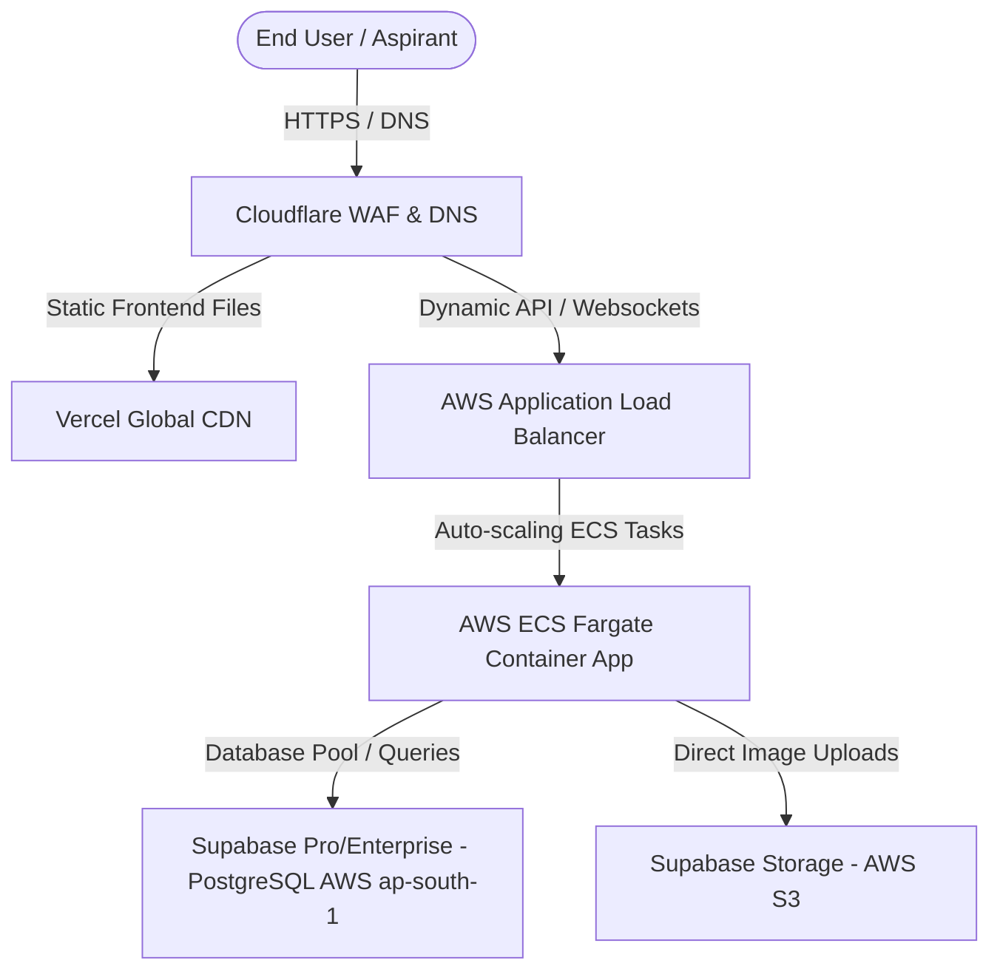

# 🚀 IkshaTests – Technical Architectural Blueprint

This document outlines the detailed system architecture, database design, security models, custom integrations, and commercial deployment blueprints for the **IkshaTests** platform.

---

## 🏗️ System Architecture

IkshaTests is built on a decoupled, full-stack architecture designed for high availability, low-latency rendering, and security during high-stakes exams.

```mermaid
graph LR
    subgraph Frontend Client (React 19)
        UI[User Interface / Views]
        AuthC[Auth Context]
        CBT[Test Console / Proctoring]
        PDF[PDF.js Client Parser]
    end

    subgraph Backend Server (Node.js Express)
        API[Express API Router]
        AI[AI OCR Orchestrator]
        SEB[SEB Config Generator]
    end

    subgraph Database & BaaS (Supabase)
        DB[(PostgreSQL Database)]
        RLS{Row-Level Security}
        Storage[Supabase Object Storage]
    end

    UI -->|API Requests via Axios| API
    CBT -.->|Safe Exam Browser PLIST| SEB
    PDF -->|Base64 Page Images| AI
    AI -->|Gemini / OpenAI API| ExternalAI[External LLM Providers]
    API --> RLS
    RLS --> DB
    API --> Storage
```

---

## 🗄️ Database Schema & Security

The database is built on PostgreSQL hosted via Supabase, with strictly defined tables and triggers to manage users, tests, questions, and student submissions.

### 1. Database Schema SQL Definition
Below is the database structure as defined in `supabase_schema.sql`:

* **`profiles`**: Extends the default Supabase Auth metadata.
  * `id` (`UUID`, Primary Key, references `auth.users` cascade).
  * `email` (`TEXT`, Unique, Not Null).
  * `full_name` (`TEXT`).
  * `role` (`TEXT`, Default `'student'`, checked for `'student'` or `'admin'`).
  * `created_at` (`TIMESTAMP WITH TIME ZONE`).
* **`tests`**: Metadata representing a specific examination.
  * `id` (`UUID`, Primary Key, auto-generated).
  * `title` (`TEXT`, Unique, Not Null).
  * `category` (`TEXT`, Not Null, e.g., `'JEE'`, `'NEET'`).
  * `duration_minutes` (`INTEGER`, Default `180`).
  * `scheduled_at` (`TIMESTAMP WITH TIME ZONE`, Optional lock timestamp).
  * `created_by` (`UUID`, references `profiles.id`).
  * `created_at` (`TIMESTAMP WITH TIME ZONE`).
* **`questions`**: Individual exam questions linked to tests.
  * `id` (`UUID`, Primary Key, auto-generated).
  * `test_id` (`UUID`, references `tests.id` cascade).
  * `subject` (`TEXT`, Not Null, e.g., `'Physics'`).
  * `chapter` (`TEXT`, Inferred NCERT chapter classification).
  * `type` (`TEXT`, Checked for `'MCQ'` or `'NUMERICAL'`).
  * `text` (`TEXT`, Supports LaTeX math symbols).
  * `image_url` (`TEXT`, Public link to Supabase storage assets).
  * `sub_text` (`TEXT`, LaTeX text appearing below diagrams).
  * `options` (`JSONB`, Array of options for MCQs).
  * `correct_answer` (`TEXT`, MCQ option index or exact numerical string).
  * `created_at` (`TIMESTAMP WITH TIME ZONE`).
* **`submissions`**: Aspirant answers and score sheets.
  * `id` (`UUID`, Primary Key, auto-generated).
  * `user_id` (`UUID`, references `profiles.id` cascade).
  * `test_id` (`UUID`, references `tests.id` cascade).
  * `score` (`INTEGER`, Not Null).
  * `correct_count` (`INTEGER`), `wrong_count` (`INTEGER`), `skipped_count` (`INTEGER`).
  * `answers` (`JSONB`, Nested student response indices and proctoring log payloads).
  * `created_at` (`TIMESTAMP WITH TIME ZONE`).

### 2. Row Level Security (RLS) Policies
Each table has active Row-Level Security enabled to prevent data tampering:
* **`profiles`**:
  * Users can select only their own profile (`auth.uid() = id`).
  * Admins can access and manage all profiles.
* **`tests` & `questions`**:
  * Anyone can read/select tests and questions to view exam materials.
  * Only users with the `'admin'` role can insert, update, or delete entries.
* **`submissions`**:
  * Students can read, create, and manage their own submissions (`auth.uid() = user_id`).
  * Admins can view and fetch all student submissions for analytics.

---

## 🔒 Security & Safe Exam Browser (SEB) Integration

To guarantee exam integrity, IkshaTests supports standard proctoring alongside **Safe Exam Browser (SEB)** locks.

### 1. Client-Side Proctoring Guards
The frontend `TestConsole.jsx` listens for:
* **Fullscreen API Events**: Requires `requestFullscreen()` at launch. Exiting fullscreen prompts security alerts.
* **Visibility API (`visibilitychange`)**: Tracks if the student minimizes or shifts browser tabs.
* **Focus API (`window.blur`)**: Logs if the student clicks outside the viewport or launches overlays.
* **Violation Auto-Submit**: Exceeding the maximum allowed focus losses triggers immediate test submission.

### 2. Safe Exam Browser Configuration Engine
The Express backend mounts a dynamic configuration endpoint at `/api/seb/config`. This returns a custom XML configuration payload:
```xml
<?xml version="1.0" encoding="UTF-8"?>
<!DOCTYPE plist PUBLIC "-//Apple//DTD PLIST 1.0//EN" "http://www.apple.com/DTDs/PropertyList-1.0.dtd">
<plist version="1.0">
<dict>
	<key>allowPreferencesWindow</key>
	<false/>
	<key>allowQuit</key>
	<true/>
	<key>allowSwitchToApplications</key>
	<false/>
	<key>allowVirtualMachine</key>
	<false/>
	<key>browserWindowWebView</key>
	<integer>3</integer>
	<key>originatorVersion</key>
	<string>SEB_Win_3.3.2</string>
	<key>prohibitScreenshot</key>
	<true/>
	<key>quitURL</key>
	<string>http://localhost:5173/</string>
	<key>sendBrowserExamKey</key>
	<true/>
	<key>startURL</key>
	<string>http://localhost:5173/test/your_test_id</string>
</dict>
</plist>
```
> **Implementation Note**: The dictionary key-value pairs must be sorted alphabetically. SEB Windows/Mac clients check this XML format to enforce system-level locks, block screenshots, restrict virtual machines, and prevent application switching.

---

## 🧠 AI-Powered Question Ingestion Flow

The platform includes automated parsing features located in `AddTestPage.jsx` and the backend `server.js`.

### 1. PDF Document Flow
1. **Client-Side Rendering**: The admin uploads a test PDF. The frontend utilizes **PDF.js** to render each PDF page onto a canvas, extracting it as a high-resolution base64 JPEG image string.
2. **Gemini Ingestion**: The base64 array is posted to the backend `/api/admin/extract-pdf` endpoint.
3. **Structured AI Extraction**:
   * The server runs a structured prompt through `gemini-2.5-flash` (or falls back to `openai` `gpt-4o-mini`).
   * The prompt instructs the model to return structured JSON mapping equations into LaTeX, separating MCQs, questions, choices, subjects, and NCERT chapters.
   * Diagram bounding boxes are captured using coordinate mapping (`[ymin, xmin, ymax, xmax]`) normalized to a 1000x1000 scale.
4. **Answer Key Integration**: An optional answer key table/grid on final pages is extracted, parsed, and merged into the question list.

### 2. Microsoft Word (.docx) Flow
1. The admin uploads a `.docx` file.
2. The frontend sends it base64-encoded to `/api/admin/extract-docx`.
3. The server uses **Mammoth.js** to convert the document.
4. **Embedded Image Upload**: Mammoth parses inline images, uploading them directly to the Supabase `question-assets` bucket and generating public URLs.
5. **JSON Structuring**: The HTML generated by Mammoth is passed to the Gemini LLM to parse into structured test objects.

---

## 🌐 Commercial Production Infrastructure (Industry Standard)

To launch IkshaTests commercially to support high-concurrency exam schedules, the following industry-standard architecture is recommended:



### 1. DNS, CDN, and Security Layer (Cloudflare)
* **WAF & DDoS Mitigation**: Acts as the entry gate for all traffic. Implements custom rate limits to block malicious scraper bots, stops script injections, and prevents massive DDoS attacks.
* **DNS Resolution**: Fast globally distributed DNS resolving in under 10ms.

### 2. Frontend Client Hosting (Vercel)
* **Edge CDN**: Serves the pre-compiled Vite React static bundle. Static pages, fonts, CSS files, and KaTeX styles are cached and delivered locally to students.
* **Branch Deployments**: Simplifies version testing and preview staging via git integration.

### 3. Application API Server (AWS ECS on Fargate)
* **Elastic Scalability**: Node.js Express endpoints are containerized and run via ECS. Fargate dynamically scales the number of running server tasks up or down based on CPU and request volume.
* **API Latency**: Deployed in the **ap-south-1 (Mumbai)** region to keep connection handshakes minimal for Indian test-takers.

### 4. Production Database Tier (Supabase Pro/Enterprise)
* **High Connection Count**: Uses Supavisor/PgBouncer to pool and reuse Postgres database connections during sudden test submission surges.
* **S3 Backup Storage**: Supabase storage is backed by AWS S3 buckets to host diagram assets with point-in-time recovery enabled.
